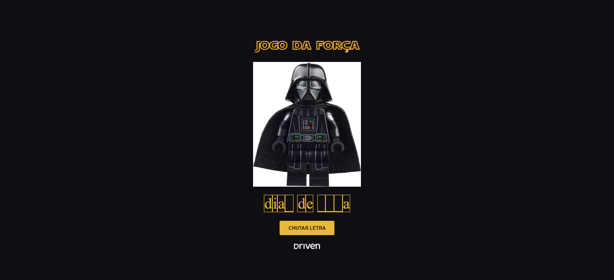

# Projeto Driven - Dev nas Estrelas

  

### Projeto construído no evento da Driven.

Um jogo da forca, construído com as tecnologias mencionadas, onde os chutes são realizados através de inputs, e com regras pré-estabelecidas no JavaScript, a imagem do Darth Vader vai aparecende conforme os erros.

[Clique aqui para acessar](https://oibaro.github.io/project-rocketseat-COPA/)
  

## Tecnologias

- HTML
- CSS
- Git e GitHub
- Javascript
